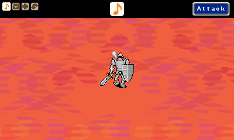

# RPG Project

A C# recreation of HAL Labratory's [*Mother 3*](https://earthbound.fandom.com/wiki/Mother_3).

# Battle System

  
  

# Thanks
* [MonoGame](http://www.monogame.net/), an open-source, updated implementation of Microsoft's XNA framework.
* [Gary M. Josack](https://github.com/gmjosack) for his [tutorial](https://gmjosack.github.io/posts/my-first-2d-pixel-shaders-part-1/) on pixel shaders using HLSL.